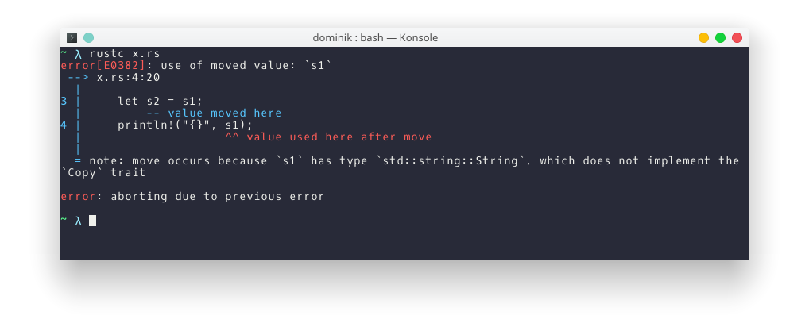
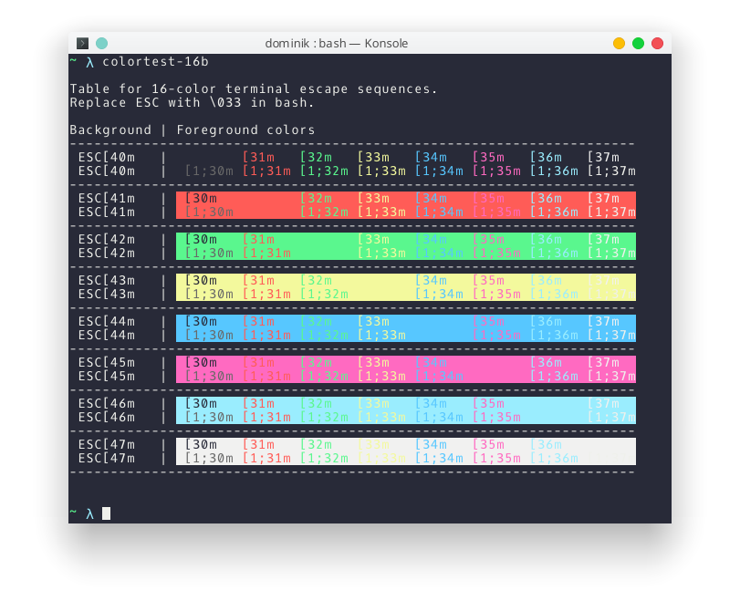

# konsole-snazzy

> Elegant [Konsole](https://konsole.kde.org/) theme with bright colors

## Install

- Download [`snazzy.colorscheme`](https://github.com/miedzinski/konsole-snazzy/raw/master/snazzy.colorscheme)
to `$XDG_DATA_HOME/konsole/`.
- Select `snazzy` in profile options under `Appearance` tab.

## Related

- [hyper-snazzy](https://github.com/sindresorhus/hyper-snazzy) - Hyper version
- [iterm2-snazzy](https://github.com/sindresorhus/iterm2-snazzy) - iTerm2 version
- [terminal-snazzy](https://github.com/sindresorhus/terminal-snazzy) - Terminal version
